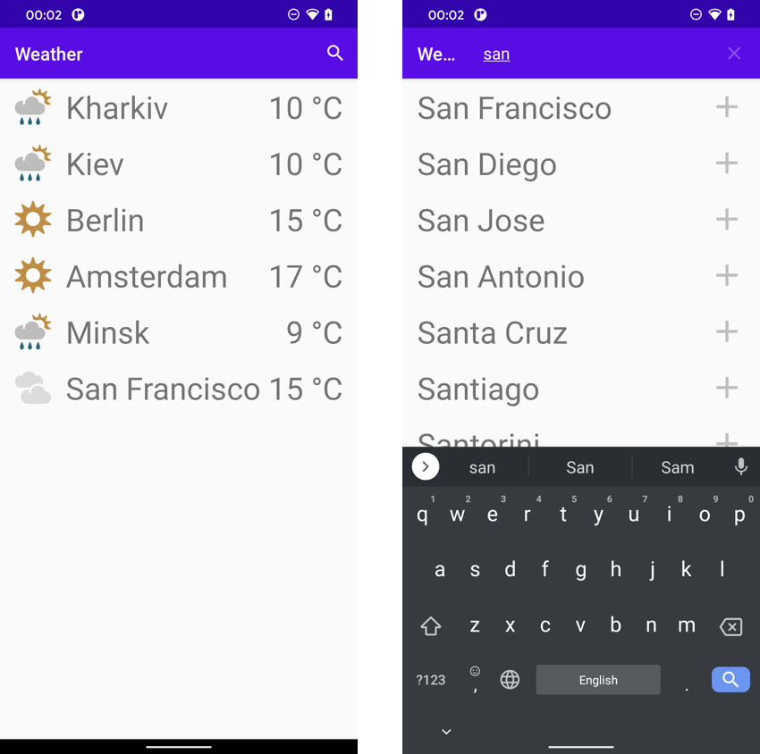

# 🇺🇦 #StandWithUkraine
On Feb. 24, 2022 Russia declared an [unprovoked war on Ukraine](https://war.ukraine.ua/russia-war-crimes/) and launched a full-scale invasion. Russia is currently bombing peaceful Ukrainian cities, including schools and hospitals and attacking civilians who are fleeing conflict zones.

Please support Ukraine by lobbying your governments, protesting peacefully, and donating money to support the people of Ukraine. Below are links to trustworthy organizations that are helping to defend Ukraine in this unprovoked war:

* [Donate to Come Back Alive](https://www.comebackalive.in.ua/donate)
* [Donate to KOLO](https://koloua.com/en/)
* [Donate to Prytula Foundation](https://prytulafoundation.org/en)

# Swift Weather App  
Cross-platform Swift application 



## Arhitecture

Architecture based on reusing as much as possible code written on Swift. Currently, Swift Weather Core includes weather repository that handles loading info from the database and fetching new data from providers.

```
                                    ------------------------------------------
                                  /                        \                   \
  +---------+    +---------------------+    +-----------+   \   +---------+     \   +----------+
  |  macOS  |<-->|  Swift Weather Core |<-->|  Android  |     ->|   iOS   |       ->|  Windows |
  +---------+    +---------------------+    +-----------+       +---------+         +----------+
                 |  Weather repository |
                 +---------------------+
                 |   Weather database  |
                 +---------------------+
                 |   Weather provider  |
                 +---------------------+
```


## How to build [Android]

For building an Android application you need [Readdle's Swift Android Toolchain](https://github.com/readdle/swift-android-toolchain#installation). Please follow the guideline on installation first.
After a successful setup, you can clone this repo and build it with Android Studio as any other android project. 


## How to build [iOS/MacOS]

For building an iOS application you need [Xcode 12](https://developer.apple.com/services-account/download?path=/Developer_Tools/Xcode_12_beta/Xcode_12_beta.xip). Minimal target version of operation systems is iOS 14 and MacOS 11.


## How to build [Windows]

In progress...
