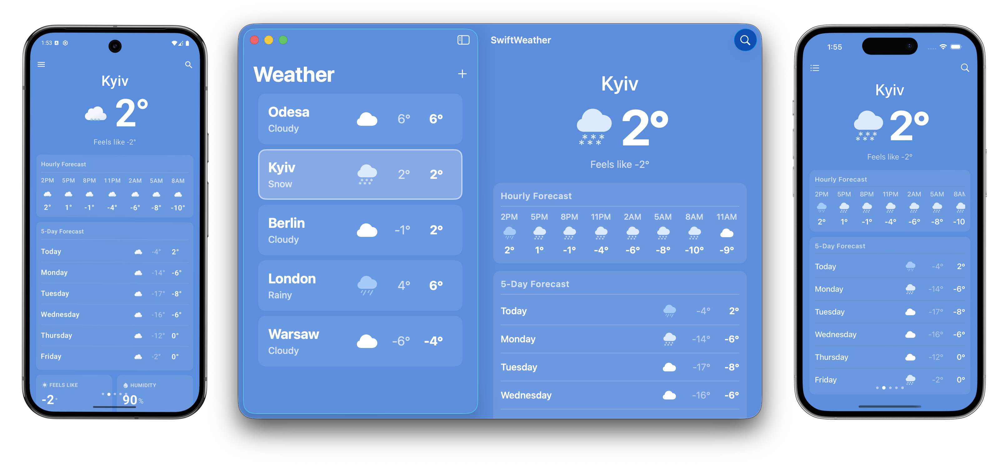
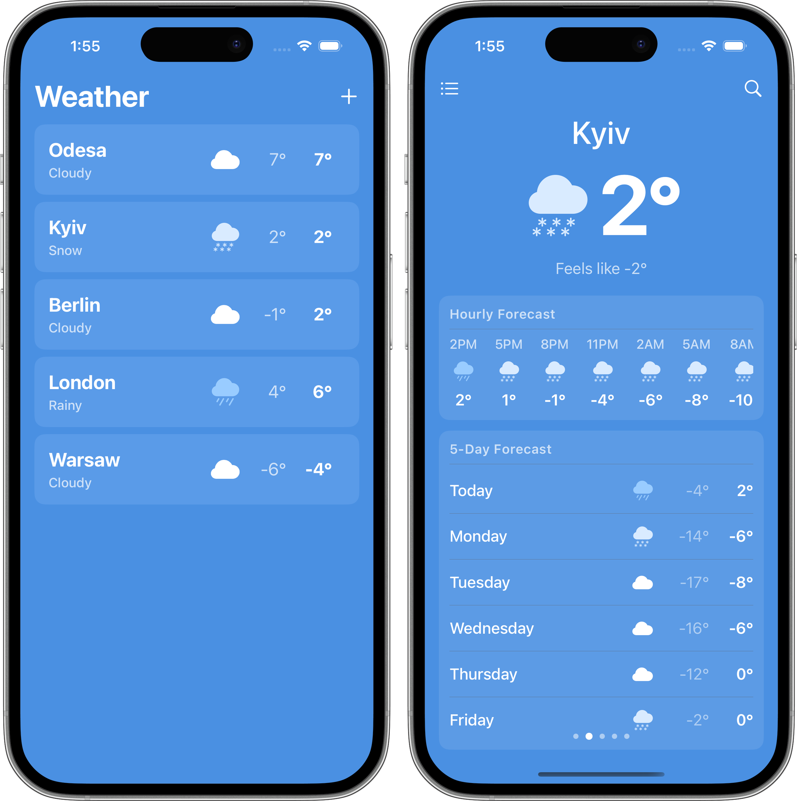
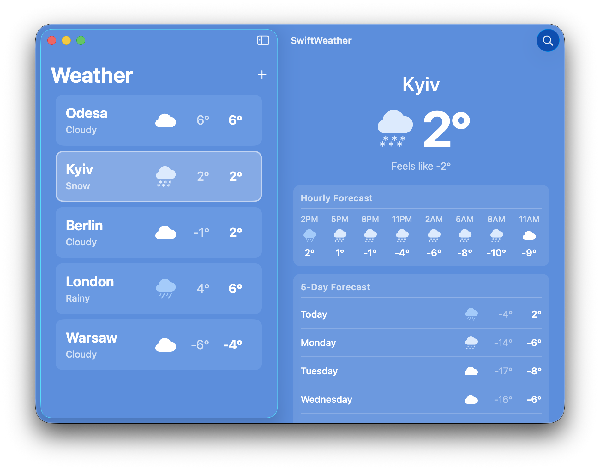

# 🇺🇦 #StandWithUkraine
On Feb. 24, 2022 Russia declared an [unprovoked war on Ukraine](https://war.ukraine.ua/russia-war-crimes/) and launched a full-scale invasion. Russia is currently bombing peaceful Ukrainian cities, including schools and hospitals and attacking civilians who are fleeing conflict zones.

Please support Ukraine by lobbying your governments, protesting peacefully, and donating money to support the people of Ukraine. Below are links to trustworthy organizations that are helping to defend Ukraine in this unprovoked war:

* [Donate to Come Back Alive](https://savelife.in.ua/en/)
* [Donate to KOLO](https://koloua.com/en/)
* [Donate to Prytula Foundation](https://prytulafoundation.org/en)

# Swift Weather App    

Cross-platform Swift weather application for **Android**, **iOS**, **iPadOS**, and **macOS**.

The app shares a common Swift core (`WeatherCore`) for business logic, networking, and persistence across all platforms. Each platform has its own native UI layer - Jetpack Compose on Android and SwiftUI on Apple platforms.



## Architecture

Architecture based on reusing as much as possible code written in Swift. The Swift Weather Core includes the weather repository that handles loading info from the database and fetching new data from providers.

```
                                    ------------------------------------------
                                  /                        \                   \
  +---------+    +---------------------+    +-----------+   \   +---------+     \   +----------+
  |  macOS  |<-->|  Swift Weather Core |<-->|  Android  |     ->|   iOS   |       ->|  Windows |
  +---------+    +---------------------+    +-----------+       +---------+         +----------+
                 |  Weather repository |
                 +---------------------+
                 |   Weather database  |
                 +---------------------+
                 |   Weather provider  |
                 +---------------------+
```

## Platforms

| Platform | UI Framework | Min Version | Layout |
|---|---|---|---|
| Android | Jetpack Compose | API 29 | Phone navigation |
| iPhone | SwiftUI | iOS 16.0 | NavigationStack with pager |
| iPad | SwiftUI | iPadOS 16.0 | Master-detail (NavigationSplitView) |
| macOS | SwiftUI | macOS 13.0 | Master-detail (NavigationSplitView) |
| Windows | - | - | Planned |

## Project Structure

```
swift-weather-app/
├── core/                   # Shared Swift Package (WeatherCore)
│   ├── Sources/WeatherCore/
│   │   ├── Data/           # Data models (Weather, Location, Forecasts, WeatherState)
│   │   ├── OpenWeather/    # API provider and response parsing
│   │   ├── ViewModel/      # ViewModels with delegate pattern
│   │   └── JSONStorage/    # JSON file-based persistence
│   └── Tests/
├── android/                # Android app (Kotlin + Jetpack Compose)
│   └── app/src/main/
│       ├── java/           # Kotlin UI, ViewModel, Hilt DI
│       ├── swift/          # Swift-Kotlin bridge package
│       └── res/            # Resources and drawables
├── apple/                  # Apple app (SwiftUI - iOS/iPadOS/macOS)
│   ├── Shared/             # Shared SwiftUI views and ViewModel
│   ├── iOS/                # iOS-specific config (Info.plist)
│   └── macOS/              # macOS-specific config (Info.plist, entitlements)
└── .github/workflows/      # CI workflows
```

## How to Build

### Android


For building the Android application you need [Readdle's Swift Android Toolchain](https://github.com/readdle/swift-android-toolchain#installation). Please follow the installation guide first.

**Prerequisites:**
- [Readdle's Swift Android Toolchain](https://github.com/readdle/swift-android-toolchain#installation)
- Android NDK 27.3.13750724
- Swift 6.2 toolchain
- Java 17

**Steps:**

1. Create `android/local.properties` and add your OpenWeatherMap API key:
   ```
   API_KEY=your_openweathermap_api_key
   ```
2. Build and install:
   ```bash
   cd android && ./gradlew installDebug
   ```

The Gradle build automatically compiles the Swift core and bridge package via the `com.readdle.android.swift` plugin.

### iOS / iPadOS / macOS





**Prerequisites:**
- Xcode 15 or later
- Swift 6.2 toolchain

**Steps:**

1. Create `apple/Local.xcconfig` and add your OpenWeatherMap API key:
   ```
   WEATHER_API_KEY = your_openweathermap_api_key
   ```
   This file is git-ignored. The Xcode project references it as a base configuration. Both `iOS/Info.plist` and `macOS/Info.plist` inject the key via `$(WEATHER_API_KEY)`, and the app reads it at launch with `Bundle.main.object(forInfoDictionaryKey:)`.

2. Open `apple/SwiftWeather.xcodeproj` in Xcode.
3. Select the **iOS** or **macOS** scheme and build/run.

Or build from the command line:

```bash
# iOS Simulator
cd apple && xcodebuild -scheme iOS -destination 'generic/platform=iOS Simulator' build

# macOS
cd apple && xcodebuild -scheme macOS build
```

### Swift Core Tests

```bash
cd core && swift test
```
